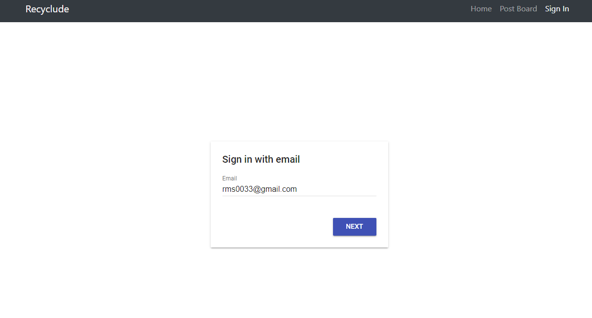

# Recyclude
## _SE Term Project Team 1_
##

Recyclude is a web-based community sharing the information of recycling.

- Offer the new form of recycling information from local government website
- Offer the platform for sharing recycling know-how amnog users.

## Features

- Crawling local government website and reformatting to card-view
- Sign in/Sign out for using post board
- Write a post to sharing user's recycling know-how
- Write a comment for interaction among users

## Tech

Recyclude consists of some techniques below.

- HTML - Web Page UI
- [Bootstrap] - Web Page Style Template
- JavaScript - Operation Implementation
- [Firebase] - great UI boilerplate for modern web apps

## Start Using Recyclude

Recyclude is a website, You can join [This URL]

If you want to sign up our page, just enter your e-mail in UI box.

Then, You can enter your name and password in UI box.

## Components

Recyclude consists of 5 main HTML Files below.

| HTML | Operation |
| ------ | ------ |
| index | Main Page, Show Card-View of recycling information |
| post_list | Show the list of posts written by users |
| signin | Sign In & Sign Up |
| post | Show a specific post that users clicked and Write a comment |
| writepost | Write a post of recycling know-how |

## License

Gachon University
Proejct Team members

[//]: # (These are reference links used in the body of this note and get stripped out when the markdown processor does its job. There is no need to format nicely because it shouldn't be seen. Thanks SO - http://stackoverflow.com/questions/4823468/store-comments-in-markdown-syntax)

   [Bootstrap]: <http://bootstrapk.com/>
   [Firebase]: <https://firebase.google.com/?hl=ko>
   [This URL]: <https://sangwoo9734.github.io/SE_TEAM1/project/>
   
